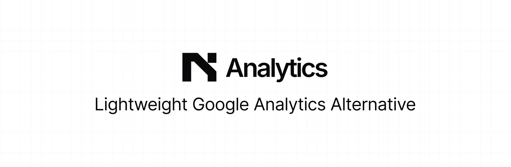

<h3 align="center">Analytics</h3>

<p align="center">
    Lightweight Google Analytics Alternative
    <br />
    <a href="https://analytics.ritiksharma.me">Learn more</a>
    <br />
    <br />
    <a href="#introduction">Introduction</a> ·
    <a href="#features">Features</a> ·
    <a href="#tech-stack">Tech Stack</a> ·
    <a href="#self-hosting">Self-hosting</a> ·
    <a href="#contributing">Contributing</a>
</p>


## Introduction

Understand your website traffic with essential insights. No cookies, no personal data collection, just the stats that matter.


## Features

**Privacy Focused**: No cookies or invasive tracking. Respect user privacy by default.<br/>
**Lightweight Script**: Our tiny script (~1.2kB) won't slow down your website's performance.<br/>
**Essential Metrics**: Focus on key data like page views, visitors, referrers, and more.<br/>
**Simple Interface**: Clean and intuitive dashboard to easily understand your data.<br/>
**Own Your Data**: Self-hostable solution giving you full control over your analytics.<br/>
**Easy Integration**: Add a simple script tag to your website and start tracking.<br/>


## Tech Stack

- [Next.js](https://nextjs.org/) – framework
- [TypeScript](https://www.typescriptlang.org/) – language
- [Tailwind](https://tailwindcss.com/) – CSS
- [Analytics](https://analytics.ritiksharma.me/) – self-served analytics
- [Neon](https://neon.tech/) – database
- [BetterAuth](https://www.better-auth.com/) – auth
- [Vercel](https://vercel.com/) – deployments


## Self-Hosting

You can self-host for full control over your analytics.

Step 1: fork and clone the repo
```
git clone https://github.com/<username>/analytics.ritiksharma.me.git
```

Step 2: copy .env to .env.example
```
cp .env.example .env
```

Step 3: create database project in the [neon](https://neon.tech/) database and paste the connection string in the .env file for `DATABASE_URL`

Generate [secret key](https://www.better-auth.com/docs/installation#set-environment-variables) and add in .env for `BETTER_AUTH_SECRET`

Get your Google credentials, more [here](https://www.better-auth.com/docs/authentication/google#get-your-google-credentials) and then add client id and client secret in the .env for `GOOGLE_CLIENT_ID` and `GOOGLE_CLIENT_SECRET`

Step 4: install dependencies and run the command to push tha database tables to neon db
```
pnpm i
pnpm db:push
```

Step 5: deploy it to vercel and paste all teh environment variables to varcel project environemnts and change `NODE_ENV` to "production", `BETTER_AUTH_URL` and `BETTER_AUTH_URL` with domain url.


## Contributing

Here's how you can contribute:

Open an issue if you believe you've encountered a bug and make a PR to add the feature/fix.

Set up local dev environment -

Follow Step 1-4 from the [self hosting](#self-hosting) section and then

Step 4: if you want you can create dev branch in the neon db and add the connection string in the .env for `DATABASE_URL`

Step 5: sign in first to create first user and seed the data.
```
pnpm db:seed
```

Step 6: run dev mode
```
pnpm dev
```

Thanks. Happy Coding.